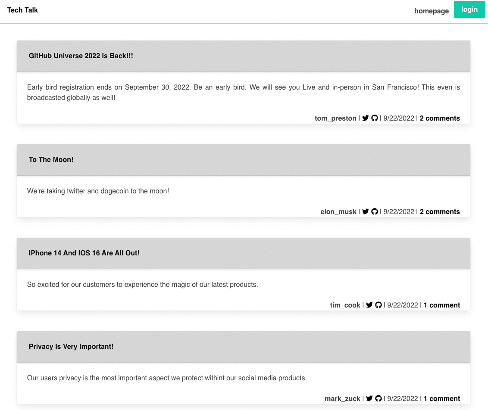
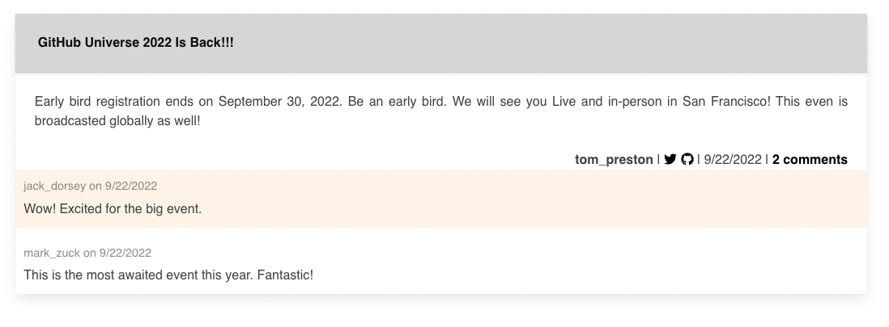
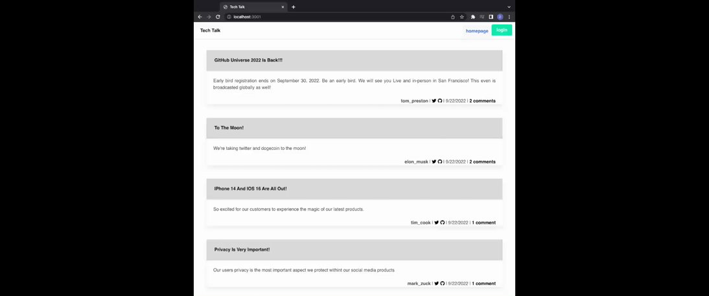
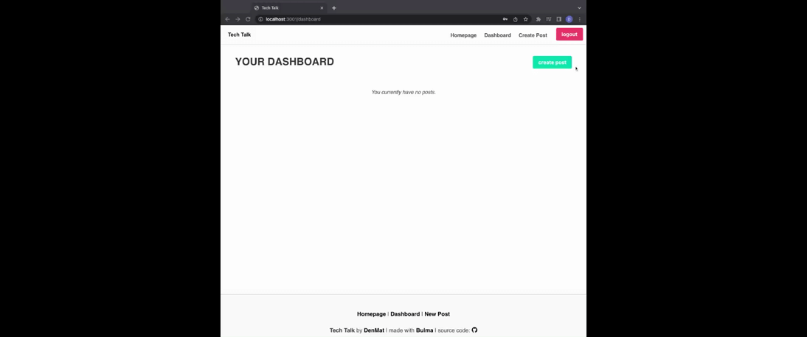
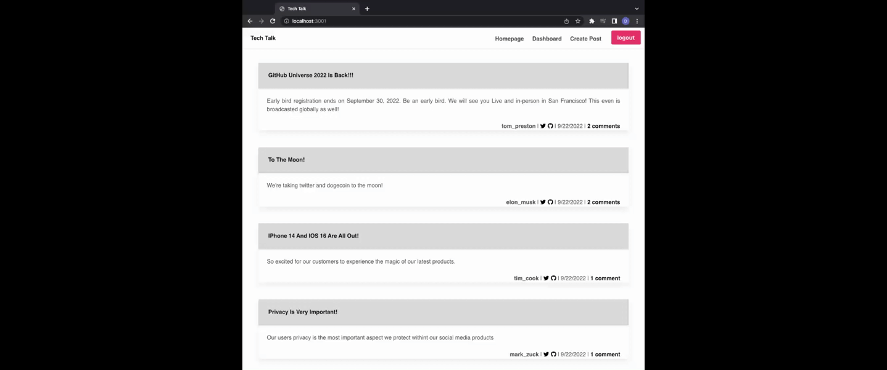
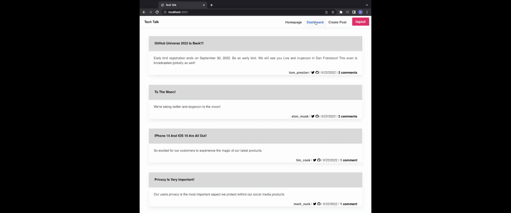

# Tech Talk Blog Site
Writing about tech can be just as important as making it. Developers spend plenty of time creating new applications and debugging existing codebases, but most developers also spend at least some of their time reading and writing about technical concepts, recent advancements, and new technologies. This application will serve as a way to publish articles, blog posts, and users' random thoughts and opinions.

This application is a CMS-style blog site similar to a Wordpress site, where users can publish their blog posts and comment on other users' posts as well.

## Installation
In able to execute the application, you will have to `git clone` the repository into your local storage. This will enable you to access all the files locally.

Run `npm install` in order to have npm package dependencies installed.

* The application will start once the user enters `npm start` in the command line.
* Once the application is running, user will be able to access the application through `http://localhost:3001`

## Usage
Users will be able to do the following:
> User will have the ability to sign up for an account or sign in.

> User will have the ability to log out whenever by clicking the `logout` button.

> User will be able to view existing blog posts the post title and the date it was created.

> User will be able to leave a comment on existing blog posts.

> User will be able to create their own posts.

> User will be able to edit or delete their old blog posts.

> User's account will automatically logout when there it is idle or there is inactivity.

## Demo
* Homepage display

* Comments on blog posts

* Sign up for an account and automatically logging in.

* User creating new blog post.

* User editing old blog post.

* User deleting old blog post.

* User logging out.

## Video Links to Full Demo
[Tech Talk Demo](https://drive.google.com/file/d/1L9__qZmJR30dBnxCn8faztvENm1Nmd4u/view)
 
  